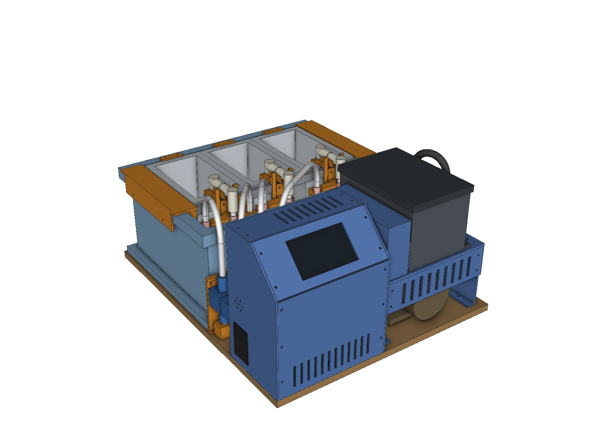
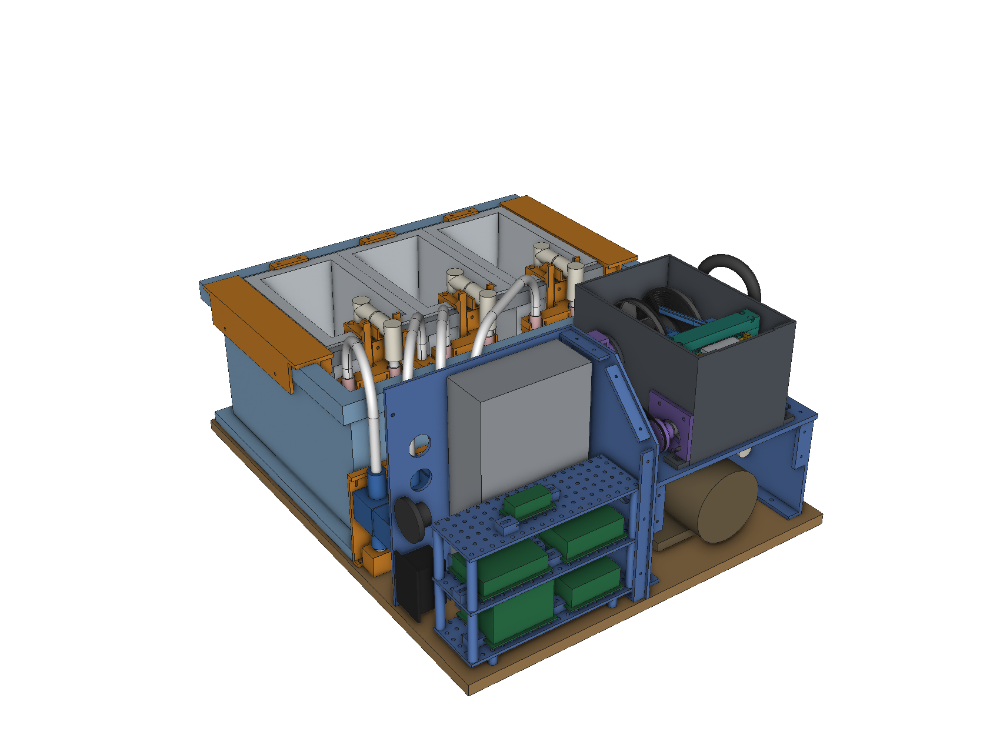
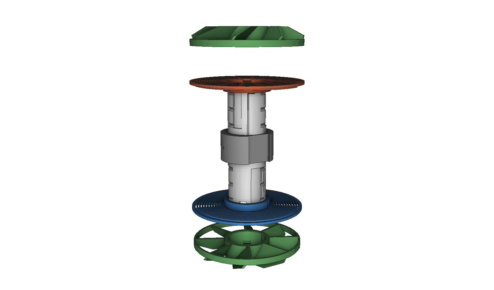
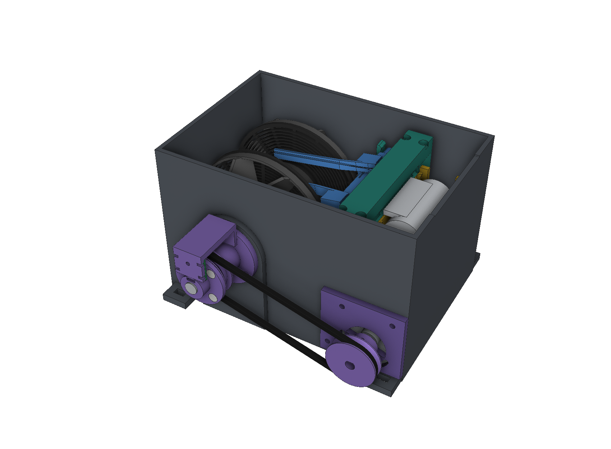
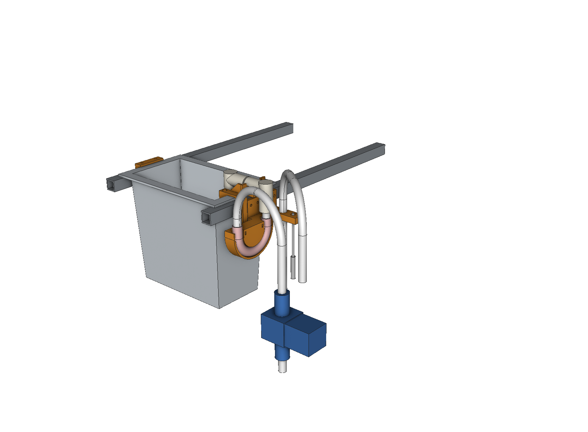
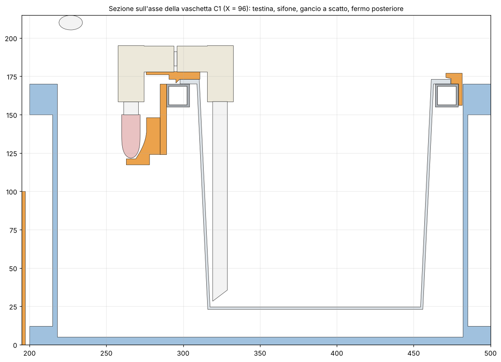
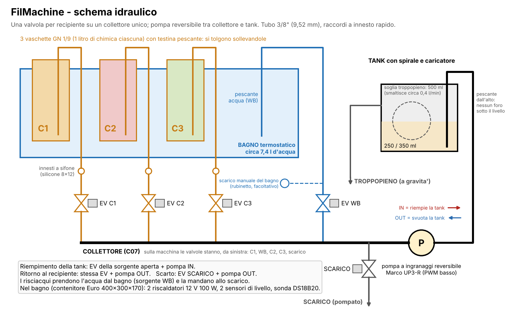
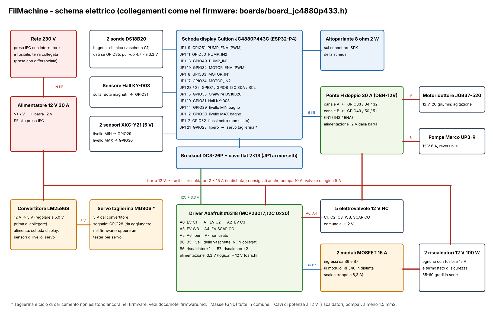

# FilMachine – macchina completa (rilascio 5)

Progetto meccanico di tutta la macchina: tank a tenuta di luce con caricatore integrato per **135 e 120**, bagno
termostatico con tre vaschette estraibili, idraulica, cavalletto con pompa, vano elettronica con display.
Usa i componenti già acquistati e i collegamenti già previsti dal firmware `FilMachine_Reworked`.

**È un progetto, non una macchina provata.** Tutto quello che segue è verificato sul modello 3D (interferenze, movimenti,
volumi); niente è stato stampato né misurato. I punti da provare a banco sono elencati in fondo.



## Cosa c'è nel pacchetto

| Cartella / file | Contenuto |
|---|---|
| `docs/FilMachine_3D.pdf` | **Assieme 3D navigabile** (Adobe Acrobat Reader): 164 corpi con nome, da accendere e spegnere uno a uno o a gruppi, 10 viste pronte. `docs/FilMachine.u3d` è lo stesso modello da solo |
| `step/ASSIEME_FilMachine.step` | Lo stesso assieme per il CAD (un solo assieme: 135 e 120 usano gli stessi pezzi) |
| `step/`, `stl/` | 62 pezzi diversi, **già nell'orientamento di stampa** (94 da stampare contando le quantità; A06 è una variante facoltativa) |
| `docs/NuovaDistinta.xlsx` | Nuova distinta: da acquistare, già acquistati e loro uso, pezzi stampati, viteria |
| `docs/schema_idraulico.pdf`, `docs/schema_elettrico.pdf` | Schemi |
| `docs/dima_base.pdf` (+ `_fori.csv`) | Dima 1:1 della base con i 32 fori |
| `docs/note_firmware.md` | Cosa funziona col firmware di oggi, cosa no, modifica minima |
| `verifiche.txt` | Tutti i controlli eseguiti sul modello: stampabilità, movimenti, volumi, viti, tagli dei tubi |
| `png/` | Viste e sezioni |
| `src/` | Sorgenti parametrici (CadQuery): le misure stanno in `common.py` e `machine.py` |

## La macchina in breve

Ingombro circa **42 × 51 × 26 cm**: 420 × 505 mm in pianta, 246 mm sopra la tavola di multistrato da 12 mm che fa da base
(il punto più alto è la curva del tubo in silicone della tank; il vano elettronica arriva a 226 mm).

- **Davanti a sinistra**: vano elettronica con il display su plancia a 45°.
- **Davanti a destra**: tank con caricatore, su un cavalletto; sotto c'è la pompa.
- **Tra elettronica e bagno**: le cinque elettrovalvole in fila sul collettore (da sinistra: C1, WB, C2, C3, scarico).
- **Dietro**: il bagno (contenitore Euro 400 × 300 × 170) con le tre vaschette GN 1/9 da 1 litro e, davanti a loro,
  una fascia libera per innesti, riscaldatori, sonde e per versare l'acqua.



## Cosa cambia rispetto al caricatore v4

- **Culla unica per 135 e 120** (B12). Il rullo 120 appoggia nella sede larga sulle flange del rocchetto; il caricatore
  135 scende nella sede centrale, 4 mm più profonda. Tra i due formati non si cambia nessun pezzo.
- **Guida a due slitte tipo Lab-Box** (B13–B15). Le stesse due slitte servono per 135 e 120: scorrono su una barra
  quadra e scattano in due posizioni. Tengono la pellicola per i bordi, con la gobba verso l'alto: il centro non tocca nulla.
- **Taglierina dal basso** (B07–B11) al posto del «tergicristallo»: due spezzoni di lama da cutter a Λ su un portalama
  che sale di 12,8 mm, mosso da un micro-servo con biella e manovella. Taglia tutta la larghezza, anche il 120.
- **Flange che si chiudono in versi opposti**: una in senso orario, l'altra antiorario, con un solo gesto.
- **Baionetta a tre denti** invece di due, con un dente più largo che fa da chiave (la flangia entra in una sola
  posizione) e una linguetta che scatta a fine corsa.
- **Tutto il resto della macchina**: bagno, vaschette, idraulica, struttura, elettronica, schemi, distinta.

## Come funziona

### Spirale (serie A)

Carico dal centro verso l'esterno: una fascetta con clip tira la pellicola sul tamburo. Le due flange si infilano
sul tubo a baionetta e si bloccano con 30° di rotazione; due anelli con alette muovono il liquido. Prima di tutto
stampare il **provino A09**: ha tre giochi (0,10 / 0,06 / 0,02 mm) per scegliere quello giusto per la propria stampante.



### Tank con caricatore (serie B)



Corpo in un pezzo solo, stampato in piedi senza supporti. Dentro: la vasca della spirale e, separato da un divisorio,
il ripiano asciutto con culla, ponte, taglierina e guida. Sotto il ripiano la galleria del motoriduttore e il vano del servo.

- **Trasmissione**: motoriduttore 20 giri/min → cinghia tonda (un O-ring 80 × 3) → albero inox Ø8 su due cuscinetti con
  paraolio. La cinghia fa anche da limitatore di coppia: quando la pellicola finisce slitta. Si tende ruotando il motore
  nella sua piastra (l'albero è eccentrico).
- **Sensore Hall**: quattro magneti sulla puleggia della spirale.
- **Spirale**: da un lato il trascinatore a tre denti, dall'altro un perno folle a molla. Per toglierla si spinge di
  5,5 mm contro la molla e si solleva; prima va sganciata la barra della guida dalle sue due selle.
- **Liquido**: entra ed esce da un pescante che sale fino a sopra il livello, quindi non c'è nessun foro sotto il
  liquido. Con 250 ml il livello è a 34 mm dal fondo, con 350 ml a 46 mm; l'asse è a 50 mm. Oltre circa 500 ml il liquido
  esce dal troppopieno.
- **Il troppopieno è piccolo**: con il livello al bordo del divisorio smaltisce circa 0,4 l/min, un quinto della portata
  di riempimento del firmware (250 ml in 8 s). Assorbe un piccolo eccesso, non un riempimento sbagliato: con 550 ml o
  più il liquido passa nel vano del caricatore. Per questo si usano solo 250 e 350 ml.
- **Luce**: coperchio a labirinto; sul lato del caricatore una feritoia lascia uscire la carta del 120.

### Bagno e vaschette (serie C)



Le vaschette sono normali bacinelle Gastronorm GN 1/9 alte 150 mm, senza fori: si lavano come una pentola. Stanno
appese a due longheroni di alluminio 15 × 15 dentro il bagno.

Ogni vaschetta porta sul bordo anteriore una **testina**: due gomiti a innesto e tre spezzoni di tubo, tenuti da una
sella stampata. Il pescante scende nella vaschetta; il codolo esterno entra nella bocca di un **sifone**, cioè uno
spezzone di tubo in silicone piegato a U nella sua culla. Nessun pezzo stampato tocca la chimica.

- **Mettere una vaschetta**: infilare il bordo posteriore sotto il labbro fisso, abbassare il davanti e premere finché i
  due ganci scattano.
- **Toglierla**: tirare verso di sé le due linguette, alzare il davanti di un paio di centimetri, tirare avanti di 4 mm e
  sollevare. La testina resta sulla vaschetta e si sfila al lavandino.
- **Sonda della chimica**: è infilata in uno dei due fori della sella di C1 e pesca nella vaschetta (una fascetta
  stretta sul cavo fa da fermo); va sfilata prima di togliere C1. La sonda del bagno sta nel portasonde C06, insieme al pescante dell'acqua.
- **Perché i ganci**: una vaschetta vuota immersa galleggia con circa 8 N. Labbro e ganci la tengono giù.



Il bagno contiene circa 7,4 litri al livello di lavoro. Fornisce anche l'acqua dei risciacqui: ogni litro prelevato
abbassa il livello di 17 mm e tra il livello di lavoro e il sensore di minimo ci sono 3,2 litri, cioè 9 riempimenti da
350 ml. Il pescante dell'acqua pesca più in alto dei riscaldatori, quindi la pompa non può scoprirli.

### Idraulica



Una valvola per recipiente, tutte su un collettore; la pompa reversibile sta tra il collettore e la tank. È lo schema
che il firmware usa già per il processo. Due uscite separate sul fianco destro: **SCARICO** (pompato) e **TROPPOPIENO**
(a gravità: la tanica deve stare più in basso della macchina).

Il collettore (C07) è stampato: sei sedi verticali con O-ring 9 × 2 in cui entrano spezzoni di tubo da 3/8". Tutto il
resto è tubo da osmosi con raccordi a innesto, più il silicone 8 × 12.

Come sono posati i tubi (tagli e raccordi in `verifiche.txt`):

- **Dalle valvole al bagno** (C1, C2, C3 e WB): un pezzo solo ciascuno, senza raccordi. Sale dalla valvola, fa un
  ponte sopra il bordo del contenitore con curve di raggio 45 mm e scende nel sifone (o nel bagno, per WB). Il tubo da
  3/8" non va piegato più stretto di 40 mm: si schiaccia. Le valvole sono in quest'ordine proprio perché i quattro
  ponti non si incrocino.
- **Scarico**: un gomito sopra la valvola, girato un po' verso il retro; il tubo corre nella rientranza del
  contenitore fino al passaparete SCARICO sul fianco destro.
- **Collettore → pompa → tank**: tra collettore e pompa non c'è l'altezza per una curva, quindi lì c'è un gomito a
  codolo che entra direttamente nella sede del collettore. Un altro gomito a codolo esce dalla pompa, poi un gomito
  normale e la salita verso la tank, che finisce con una curva larga di silicone nero sul portagomma.
- **Troppopieno**: sotto il piano del cavalletto c'è un innesto orizzontale in cui il silicone entra a pressione; da lì
  il tubo va diritto alla staffa degli scarichi, sempre in discesa, senza curve che possano strozzarlo.

### Elettronica (serie D)



Alimentatore in piedi contro la paratia, tre ripiani a griglia con le schede tenute da morsetti universali, display
sulla plancia: la scheda entra nella cornice sul retro ed è trattenuta da quattro linguette girevoli (D17), da orientare
dove non ci sono connettori. La paratia separa l'elettronica dalle valvole. I collegamenti sono quelli del firmware:
vedi lo schema.

## Uso

**Caricare un 135**
1. Aprire il coperchio. Slitte nella posizione stretta, appoggiate sul tamburo.
2. Caricatore nella culla; tirare fuori 10 cm di coda, passarla nella fessura del ponte e tra le slitte, agganciarla alla clip.
3. Chiudere il coperchio e avviare il caricamento. A fine rullino la spirale si ferma, la cinghia slitta, la lama taglia.

Il ciclo di caricamento è una funzione da aggiungere al firmware (`docs/note_firmware.md`, punto 5); per le prime prove
bastano la pagina di diagnostica per il motore e un tester per servo per la lama.

**Caricare un 120**
1. Slitte nella posizione larga. Rullo nella culla.
2. Svolgere la carta finché compare la pellicola; agganciare la pellicola alla clip e far uscire la carta dalla feritoia
   tra coperchio e corpo, sul lato del caricatore.
3. Chiudere e avviare, accompagnando la carta con la mano mentre esce. Alla fine la lama taglia la pellicola prima del nastro.

**Sviluppo**: come oggi nel firmware. Usare *Volume chimica = Basso* e tank *Piccola* (250 ml) o *Media* (350 ml).

**Bagno**: versare l'acqua nella fascia libera fino al sensore MAX, meglio già calda. Da 20 a 38 °C i due riscaldatori
impiegano circa un'ora; da 33 °C meno di 20 minuti.

**Fine lavoro**: togliere le vaschette e lavarle; far girare un processo di sola acqua per sciacquare tubi, pompa e tank.

## Stampa

- **Materiale**: PETG. Spirale, tank e coperchio in **nero** (tenuta alla luce); il resto come si vuole.
- Ugello 0,4, strato 0,2, 3–4 perimetri, riempimento 25 %. Il collettore C07 a 4 perimetri e 100 %.
- Tutti i pezzi sono già orientati. **Solo B17** (cartuccia dei cuscinetti) vuole i supporti, sotto la flangia; negli
  altri ci sono solo ponti corti, fino a 20 mm (elenco in `verifiche.txt`).
- Elenco, quantità, ingombri e note pezzo per pezzo: foglio *Pezzi stampati* della distinta. In tutto circa 1,6 kg di filamento.
- **Piatto**: tre pannelli del vano elettronica (D06, D07, D11) sono lunghi 226 mm. Su un piatto da 220 mm non entrano:
  ridurre `EL_Z1` in `machine.py` non basta (l'alimentatore è alto 215 mm), bisogna tagliarli in due nello slicer.
  Il corpo della tank è 183 × 144 × 109 mm.

## Montaggio, in ordine

1. **Base**: tagliare il multistrato 420 × 505, incollare sopra la dima stampata 1:1 (controllare il segmento da
   100 mm) e segnare i fori: preforo Ø2,5 non passante, viti da legno 3,5 × 12. I quattro fori del piede della pompa si
   segnano dalla pompa stessa.
2. **Bagno**: forare il contenitore per i due riscaldatori (Ø16,5, a 20 mm dal fondo interno, a 38 e 64 mm dalla parete
   lunga anteriore, sulla parete corta destra). Montare i riscaldatori con guarnizione dentro e fuori e il dado
   all'interno. Incollare i due sensori di livello all'esterno della parete anteriore.
3. **Telaio delle vaschette**: tagliare due longheroni da 356 mm, infilarli nelle tasche delle due testate C05,
   appoggiare il telaio sul contenitore e stringere le quattro viti M4 sotto la fascia. Avvitare sui longheroni le
   staffe C03 (con la culla C02 già montata), i fermi C04 e il portasonde C06: le posizioni sono in `verifiche.txt`.
   Viti per lamiera 2,9 con preforo da 2,4: lunghe 9,5 per C03 e C06, lunghe 13 per C04.
4. **Valvole**: collettore sulla base, O-ring ingrassati, cinque spezzoni da 33 mm, valvole, pettine C08 e una fascetta
   per valvola. Ordine da sinistra: **C1, WB, C2, C3, scarico** (le uscite del driver restano quelle dello schema:
   conta quale valvola si collega a quale uscita, non la posizione).
5. **Pompa e cavalletto**: pompa con i due raccordi filettati; fianchi, piano e frontale del cavalletto.
6. **Tank**: montare trasmissione, perno folle, servo, ponte, culla e guida; poi la tank sul cavalletto con quattro
   viti. Il coperchietto del vano servo entra nella finestra del piano: chiudere con mastice nero la tacca del cavo.
   Cavi: quello del motore esce dal lato destro della galleria e scende nel foro del piano lì accanto; quello del
   sensore Hall scende nel foro sotto il carter; quello del servo passa dalla finestra del vano servo. Tutti e tre
   arrivano all'elettronica dal passacavo Ø22 nel fianco sinistro del cavalletto.
   La fascetta della clip è una striscia di pellicola o di poliestere da 16 × 115 mm, fermata nel tamburo con uno
   spezzone di filamento da 1,75.
7. **Tubi**: tagliarli secondo la tabella in `verifiche.txt`; i quattro tubi a ponte un po' abbondanti, da rifilare
   sul posto. I due tubi in silicone che arrivano alla tank devono essere **neri**. Appuntire i tre codoli delle
   testine (Ø7,5 in punta, cono lungo 8 mm). Accorciare a 27 mm il codolo del gomito che entra nella pompa.
8. **Elettronica**: zoccolo e alimentatore, colonna dei ripiani, fianchi, paratia, frontale, plancia con il display
   (quattro linguette D17), tetto. Cablare secondo lo schema. Le viti, una per una, sono nel foglio *Viteria* della distinta.

## Misure da controllare sui componenti veri

Alcuni componenti non li ho potuti misurare. Le quote usate sono in `src/machine.py`; se le tue sono diverse basta
cambiarle e rigenerare.

| Componente | Quota assunta | Dove pesa |
|---|---|---|
| Vaschetta GN 1/9 | bordo piano largo 11 mm e spesso 3 mm, parete 1,5 mm, sformo 7 mm | sella C01, labbro C04, altezza dei ganci C03 |
| Contenitore Euro | interno 364 × 264 × 165 mm, fascia di rinforzo alta 20 mm | testate C05, lunghezza dei longheroni |
| Elettrovalvola | 82 mm tra gli attacchi, corpo 33 mm, bobina di lato | passo del collettore (35 mm), pettine C08 |
| Pompa UP3-R | attacchi sui due fianchi della testa, a 41 mm dal piano | altezza del tubo verso il collettore |
| Riscaldatore | filetto M16, esagono 22 | fori nel contenitore, carter C10 |
| Scheda display | 114,4 × 66,8 × 3,2 mm; finestra 96 × 58 centrata sulla scheda (area attiva circa 93,6 × 56,2) | plancia D09, linguette D17 |
| Schede | ingombri indicativi | solo la disposizione sui ripiani |

## Verifiche fatte sul modello

Dettagli e numeri in `verifiche.txt`.

- **Assieme**: 164 corpi, tutti solidi validi, **nessuna interferenza** tra nessuna coppia. Tutti gli STL sono chiusi.
- **Viti** (non sono modellate, quindi hanno un controllo a parte): ogni foro passante ha di fronte, sullo stesso asse,
  il suo foro filettato; attorno ai fori filettati la parete è piena; la lunghezza di ogni vite è confrontata con la
  profondità del foro e con quello che c'è dietro.
- **Spirale**: inserimento, rotazione, battuta e blocco assiale sui due lati e nelle stazioni 135 e 120; una flangia
  ruotata di 120° non entra; il verso sbagliato non si chiude; le due spirali sono in fase.
- **Taglierina**: corsa completa senza urti; a fine corsa il filo supera il cielo della fessura di 3,5 mm sui bordi
  del 135 e di 0,7 mm su quelli del 120.
- **Guida**: nessun urto da spirale vuota a piena, nei due formati; a spirale piena restano 2 mm sotto il coperchio.
- **Culla**: 135 e 120 non interferiscono, sono fermati di lato e verso il ponte, escono liberi verso l'alto.
- **Vaschette**: inserimento a bascula senza urti fino a 6° e percorso di estrazione libero, per tutte e tre.
- **Volumi**: tank, vaschette e bagno come indicato sopra.

## Cosa non è verificato e va provato

1. **Niente è stato costruito.** Forze, attriti e tenute sono stimati.
2. **Tenuta alla luce della tank**: labirinto del coperchio, feritoia della carta, tubi. Da provare con uno spezzone
   di pellicola prima di un rullino vero.
3. **Formazione dell'arco della pellicola** nelle slitte e ingresso tra le costole: è il punto più delicato del caricatore.
4. **Coppia di slittamento della cinghia** e **forza di taglio** (il servo dà circa 28 N sul portalama).
5. **Innesto a sifone**: la tenuta del codolo conico nel silicone e l'eventuale goccia quando si toglie la vaschetta.
   **Collettore stampato**: tenuta degli O-ring e porosità della stampa; l'alternativa è una fila di quattro raccordi a T, lunga 270 mm.
6. **Ganci a scatto**: forza di sgancio calcolata in circa 5 N per braccio, deformazione 1,2 %.
7. **Elettrovalvole**: sono a membrana e qui il liquido le attraversa nei due versi; la tenuta in senso contrario va provata.
   **Curve dei tubi**: il raggio di 45 mm per il tubo da 3/8" e di 30 mm per il silicone libero sono valori prudenti ma
   non provati su questi tubi; se un tubo si schiaccia, allargare la curva.
8. **Pompa**: è circa sette volte più grande del necessario e ha il corpo in ottone nichelato. Usarla a velocità bassa
   e sciacquarla dopo candeggio e fissaggio. Una peristaltica resta l'alternativa.
9. **Firmware**: il processo funziona com'è. Pulizia, svuotamento, autotest dei flussi e risciacquo linea no; il
   caricamento e la taglierina sono da scrivere. Tutto in `docs/note_firmware.md`.
10. **Riscaldatori**: non devono mai lavorare a secco; il modulo IRF540 in distinta va sostituito (vedi distinta).
11. **Il 120 resta semi-manuale**: la carta va accompagnata a mano.
12. **Sensori di livello delle vaschette**: non usati; sei XKC-Y21 e il flussimetro avanzano.
13. **PDF 3D**: si naviga solo con Adobe Acrobat Reader su computer.

## Sicurezza elettrica

La rete a 230 V entra solo nell'alimentatore, dentro il vano chiuso. Collegare la terra, usare una presa protetta da
differenziale e tenere chiuso il vano quando la macchina è alimentata: accanto ci sono acqua e chimica. Tutto il
resto lavora a 12 V. È un progetto amatoriale, non certificato.

## Rigenerare i file

```
cd src
sh all.sh /percorso/IDTFConverter   # tutto in una volta (circa 20 minuti); oppure, un passo alla volta:
python3 build_all.py            # pezzi STEP/STL, verifiche, assieme STEP (circa 12 minuti)
python3 previews.py             # viste e sezioni
python3 schemi.py && python3 dima.py && python3 make_bom.py
python3 make_pdf3d.py /percorso/IDTFConverter
```

Servono Python con CadQuery 2, VTK, matplotlib, openpyxl; per il PDF 3D anche `IDTFConverter`
(github.com/ningfei/u3d) e LaTeX con il pacchetto `media9`.
