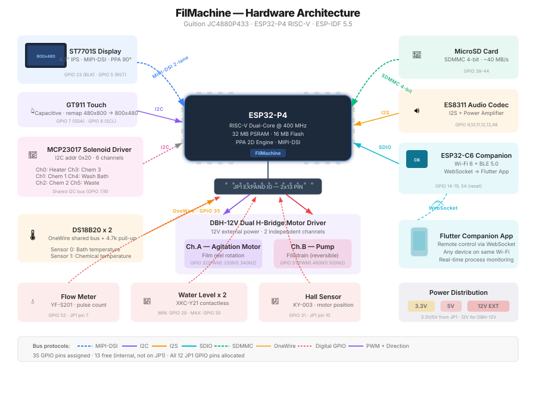

# FilMachine — Automated Film Development Machine

FilMachine is an automated film processing machine designed for photographic film development. It handles the entire process: chemical baths, water rinses, temperature regulation, and motor-driven film agitation — all controlled through a 4.3" color touchscreen display.

The project includes a **desktop simulator** (SDL2 + LVGL) that reproduces the full touchscreen UI on macOS/Linux, enabling rapid development and testing without physical hardware, plus an **automated test suite** (19 suites). A **Flutter companion app** connects via WebSocket and provides full remote control from any mobile device on the same network.

The interface is **bilingual (English / Italiano)** — selectable from Settings, applied with an automatic reboot — and every boot writes a **diagnostic log to the SD card** (`/log/boot_NNNN.txt`), including the crash summary of the previous run when the firmware panicked.

---

## Table of Contents

1. [What is FilMachine?](#what-is-filmachine)
2. [Project Architecture](#project-architecture)
3. [Directory Structure](#directory-structure)
4. [Building the Project](#building-the-project)
5. [Running the Simulator](#running-the-simulator)
6. [Running the Tests](#running-the-tests)
7. [WebSocket Server & Remote Control](#websocket-server--remote-control)
8. [Flutter Companion App](#flutter-companion-app)
9. [User Interface Guide](#user-interface-guide)
10. [Firmware Update (OTA)](#firmware-update-ota)
11. [Hardware Specifications](#hardware-specifications)
12. [Bill of Materials (Components)](#bill-of-materials-components)
13. [Diagnostics & Bring-up Page](#diagnostics--bring-up-page)
14. [Build-time Switches](#build-time-switches)
15. [Configuration & Persistence](#configuration--persistence)
16. [Language / Localization](#language--localization)
17. [SD Boot & Crash Log](#sd-boot--crash-log)
18. [Typical Workflows](#typical-workflows)
19. [Developer Quick Reference](#developer-quick-reference)
20. [Authors](#authors)

---

## What is FilMachine?

FilMachine takes the guesswork out of developing photographic film at home or in a small lab. Instead of manually timing each step, pouring chemicals by hand, and constantly checking the thermometer, FilMachine automates everything. You load your film in the developing tank, select a process, and press Start. The machine takes care of the rest: filling the right chemical at the right time, keeping the temperature stable, rotating the film at the correct speed, rinsing between steps, and alerting you when the process is complete.

It supports both **color negative** (C41, E6) and **black & white** film development workflows, with full customization of every parameter.

---

## Project Architecture

The project has a **dual-target build system** that produces ESP32-P4 firmware or a native desktop application from the same codebase. The only supported hardware board is the **Guition JC4880P433** (ESP32-P4).

### Technology Stack

| Layer | Firmware (ESP32-P4) | Simulator (macOS/Linux) |
|-------|-------------------|------------------------|
| **UI Library** | LVGL 9.2.2 | LVGL 9.2.2 (identical) |
| **Display** | ST7701S 480×800 MIPI-DSI → landscape 800×480 via PPA | SDL2 window (800×480) |
| **Touch Input** | GT911 (physical 480×800 → remapped to 800×480) | SDL2 mouse events |
| **Storage** | FatFS on MicroSD (SDMMC 4-bit, ~40 MB/s) | POSIX file I/O (sd/ directory) |
| **RTOS** | FreeRTOS (ESP-IDF) | Stub (queues work, tasks are no-ops) |
| **2D Acceleration** | PPA hardware engine (rotate, scale, blend, fill) | — |
| **Audio** | ES8311 codec via I2S + power amplifier | — |
| **Temp Sensors** | DS18B20 OneWire | Simulated (20°C ambient, heater model) |
| **Motor/Pump** | DBH-12V dual H-bridge (motor ch.A + pump ch.B) + MCP23017 solenoid driver | printf stubs |
| **OTA Updates** | esp_ota_ops + esp_http_server | Simulated (progress timer) |
| **Build Tool** | ESP-IDF (`idf.py`) | CMake + Make |
| **Sensors** | Flow meter, water level, hall effect | Simulated |
| **Compiler** | riscv32-esp-elf-gcc | Native cc/gcc/clang |

### How the Simulator Works

The simulator replaces all hardware-specific code with a **stub layer** that provides compatible implementations:

- **FatFS stubs** map firmware paths (e.g., `/FilMachine.cfg`) to files inside the `sd/` subdirectory relative to the executable, so read/write operations work transparently.
- **FreeRTOS stubs** provide working queue implementations (xQueueCreate, xQueueSend, xQueueReceive) using simple circular buffers. Task creation is a no-op since there are no real threads — instead, the main loop drains the system queue every frame.
- **Hardware stubs** (GPIO, I2C, SPI, solenoid driver, motor, temperature) are either no-ops or printf-based logging functions. Temperature readings come from a simple thermal model that simulates heating/cooling.
- **OTA stubs** simulate the firmware update flow with a progress timer (0→100%) and fake IP address, allowing full UI testing without real hardware.
- **LVGL's SDL2 driver** provides the display backend and mouse input, which simulates the capacitive touchscreen.

The key architectural principle is that **all UI code is shared 1:1** between firmware and simulator. Pages, elements, event handlers, and business logic are identical — only the hardware abstraction layer changes.

---

## Directory Structure

```
FilMachine_Reworked/
│
├── main/                          # Core source (shared with ESP32 firmware)
│   ├── include/
│   │   └── FilMachine.h           #   Main header — all structs, enums, constants, prototypes
│   ├── FilMachine.c               #   ESP32 entry point — board-conditional display/touch init
│   ├── accessories.c              #   Utilities — linked lists, deep copy, config I/O, keyboard
│   ├── lang.c                     #   EN/IT string table (generated by scripts/gen_lang.py)
│   ├── sd_log.c                   #   Boot/crash logger on SD (/log/boot_NNNN.txt, firmware only)
│   ├── mini_json.c                #   Dependency-free JSON parser for the config file
│   ├── ota_update.c               #   OTA firmware update (SD card + Wi-Fi web server)
│   ├── ws_server.c                #   WebSocket server for Flutter companion app
│   └── ui_profile.c               #   Centralized UI layout constants (800×480)
│
├── c_pages/                       # UI pages (screens)
│   ├── page_splash.c              #   Splash screen — standard, random, and custom modes with
│   │                              #     10 palettes, 6 shape styles, 9 title fonts, PRNG engine
│   ├── page_menu.c                #   Tab bar navigation (Processes / Settings / Tools)
│   ├── page_processes.c           #   Process list with filtering
│   ├── page_processDetail.c       #   Process creation & editing
│   ├── page_stepDetail.c          #   Step creation & editing with validation
│   ├── page_settings.c            #   Machine settings (temp, speed, alarms, timers, Wi-Fi)
│   ├── page_tools.c               #   Maintenance tools, import/export, statistics, OTA
│   └── page_checkup.c             #   Process execution — the most complex page
│
├── c_elements/                    # Reusable UI components
│   ├── element_process.c          #   Process list item (drag, delete, duplicate)
│   ├── element_step.c             #   Step list item (swipe gestures, edit/delete)
│   ├── element_filterPopup.c      #   Filter dialog (name, type, preferred)
│   ├── element_messagePopup.c     #   Generic confirmation/alert popups
│   ├── element_rollerPopup.c      #   Numeric selector (roller) widget
│   ├── element_cleanPopup.c       #   Cleaning process UI with timer
│   ├── element_drainPopup.c       #   Drain process UI with animated tank bars
│   ├── element_splashPopup.c      #   Splash screen config popup with live preview
│   ├── element_selfcheckPopup.c   #   Self-check diagnostic wizard (8-phase hardware test)
│   ├── element_otaWifiPopup.c     #   Wi-Fi OTA update popup (IP + PIN + progress)
│   └── element_wifiPopup.c       #   Wi-Fi connection popup (scan, connect, status)
│
├── c_fonts/                       # Custom icon fonts (7 sizes: 15/20/30/40/50/60/100px)
│   │                              #   + 8 custom splash title fonts (48px) + Montserrat 64
├── drivers/                       # Custom peripheral drivers (ESP-IDF compatible)
│   ├── include/                   #   Driver headers (mcp23017.h, ds18b20.h, sensors.h, audio.h)
│   ├── mcp23017.c                 #   I2C 16-bit I/O expander (Adafruit solenoid driver)
│   ├── ds18b20.c                  #   OneWire temperature sensor (shared bus)
│   ├── audio.c                    #   ES8311 codec bring-up + tone/volume (board only)
│   └── sensors.c                  #   Flow meter, water level, hall effect sensors
│
├── components/                    # ESP32-P4 specific hardware drivers
│   ├── st7701_lcd/                #   ST7701S MIPI-DSI LCD driver (480×800)
│   ├── ppa_engine/                #   PPA hardware 2D accelerator (rotate, scale, fill, blend)
│   ├── driver/                    #   ESP-IDF driver compatibility shims
│   └── espressif__esp_lcd_touch/  #   Touch panel abstraction layer
│
├── src/
│   └── main.c                     # Simulator entry point (SDL2 display, main loop,
│                                  #   demo data generator, system queue drain)
│
├── stub/                          # Hardware abstraction for simulator
│   ├── esp_stubs.h/c              #   ESP32 GPIO, timer, heap stubs
│   ├── fatfs_stubs.h/c            #   FatFS → POSIX filesystem mapping
│   ├── freertos_stubs.h/c         #   Queue stubs (circular buffer), task stubs (no-op)
│   ├── driver/                    #   GPIO, I2C, LEDC, SDMMC driver stubs
│   └── (redirect headers)         #   Thin #include wrappers for ESP-IDF compatibility
│
├── tests/                         # Automated test suite
│   ├── test_runner.h/c            #   Test framework & entry point
│   ├── test_helpers.c             #   Touch input simulation
│   ├── test_navigation.c          #   Splash, menu, tab switching
│   ├── test_processes.c           #   Process list display & creation
│   ├── test_process_crud.c        #   Process create/read/update/delete
│   ├── test_steps.c               #   Step creation, swipe, deletion
│   ├── test_step_crud.c           #   Step lifecycle
│   ├── test_execution.c           #   Process checkup execution flow
│   ├── test_persistence.c         #   Config save/load/restore
│   ├── test_settings.c            #   Settings UI & validation
│   ├── test_filter.c              #   Filter logic
│   ├── test_tools.c               #   Maintenance tools
│   ├── test_edge_cases.c          #   Boundary conditions & error paths
│   ├── test_utilities.c           #   Helper function tests
│   ├── test_ota.c                 #   OTA update UI & Wi-Fi popup tests
│   ├── test_websocket.c           #   WebSocket command tests
│   ├── test_new_settings.c        #   Extended settings tests
│   ├── test_selfcheck.c           #   Self-check wizard tests
│   ├── test_live_sync.c           #   Live sync integration tests
│   ├── test_ui_profile.c          #   UI profile validation & sensor stubs
│   └── test_destroy_and_lifecycle.c # Memory cleanup & object destruction
│
├── lvgl/                          # LVGL 9.2.2 library (auto-cloned on first build)
├── lvgl_config/
│   └── lv_conf.h                  # LVGL configuration (RGB565, 256KB heap, dark theme)
│
├── boards/                        # Board-specific hardware definitions
│   ├── board.h                    #   Board selector (includes correct board header)
│   ├── board_jc4880p433.h         #   JC4880P433 pin assignments, peripherals, H-bridge config
│   └── board_simulator.h          #   Simulator stubs (matching pin constants)
│
├── scripts/
│   └── genFilMachineCFG.py        # Config generator (realistic film recipes)
│
├── CMakeLists.txt                 # Dual-target build (ESP-IDF P4 + simulator/tests)
├── partitions.csv                 # Custom OTA partition table (16 MB flash)
├── sdkconfig.defaults             # ESP-IDF shared defaults
├── sdkconfig.defaults.esp32p4     # ESP-IDF defaults for ESP32-P4 target
├── setup.sh                       # Project initialization script
├── flash.sh                       # Flash firmware to ESP32 board
└── flash_p4.sh                    # Flash helper for ESP32-P4 target
```

---

## Building the Project

### Prerequisites

**macOS:**
```bash
brew install cmake sdl2 pkg-config
```

**Ubuntu / Debian:**
```bash
sudo apt install cmake libsdl2-dev pkg-config build-essential
```

LVGL 9.2.2 is automatically cloned from GitHub on the first build if not present.

### Build the Simulator

```bash
mkdir -p build800 && cd build800
cmake ..
make filmachine_sim
```

The simulator opens an 800×480 window matching the JC4880P433 physical panel in landscape orientation.

### Build the Tests

```bash
mkdir -p build800 && cd build800
cmake ..
make filmachine_test
./filmachine_test
```

### Build the Firmware

Requires the [ESP-IDF](https://docs.espressif.com/projects/esp-idf/en/latest/) toolchain (**v5.5.x** or later) installed and configured.

**Important:** run `idf.py` from the **project root**, not from `build800/`.

```bash
cd FilMachine_Reworked
. $HOME/esp/esp-idf-v5.5/export.sh     # Must be ESP-IDF 5.5.x or later

# First-time setup: set target to esp32p4 (creates sdkconfig from defaults)
idf.py set-target esp32p4

# Build — board is auto-detected from IDF_TARGET
idf.py build
```

The `main/CMakeLists.txt` automatically sets `-DBOARD_JC4880P433`. No manual `-DCMAKE_C_FLAGS` flag is needed (passing `-D CMAKE_C_FLAGS="-DBOARD_JC4880P433"` is harmless but redundant).

> **See [`COMMANDS.md`](COMMANDS.md)** for the canonical quick reference: simulator + board build, flash/monitor, generating and copying the SD config, version bumping and cleanup.

#### Flash and monitor

The firmware binary is produced at `build/FilMachine.bin`. To flash it directly to a connected board:

```bash
idf.py flash
```

Or use the helper script:
```bash
./flash.sh
```

**P4 note:** the bootloader offset on ESP32-P4 is `0x2000` (different from ESP32-S3's `0x0`). This is handled automatically by `idf.py` when the target is set correctly.

To check the firmware size (useful for verifying OTA partition fit):
```bash
idf.py size
```

---

## Running the Simulator

### Simulator UI debug overlay

The simulator includes a built-in UI inspection mode to speed up layout tuning.

- Press **F2** to enable or disable the overlay.
- When enabled, moving the mouse over the UI shows:
  - the resolved component name when available (for example `gui.page.processes.newProcessButton`)
  - the object position (`x`, `y`)
  - the object size (`w`, `h`)
- While the overlay is enabled, **right click** dumps the hovered object to the terminal/console.

This is especially useful when adjusting coordinates inside `ui_profile.c`, because you can identify the exact widget and immediately see its current geometry in the simulator.


```bash
cd build800
./filmachine_sim
```

The simulator opens an 800×480 window that reproduces the exact touchscreen interface. Use the mouse to simulate touch input (click = tap, click-drag = swipe/scroll).

### What works in the simulator

- Full UI navigation (all pages, popups, dialogs)
- Splash screen with live preview popup, 10 palettes, 6 shape styles, 9 custom fonts
- Process creation, editing, duplication, deletion
- Step management with swipe gestures
- Settings with slider/switch/radio controls
- Filter and search functionality
- Configuration save/load (reads/writes `sd/FilMachine.cfg`)
- Export/Import (backup to `sd/FilMachine_Backup.cfg`)
- Drain machine with animated tank-level bars and relay management
- Clean machine with per-container rinse cycles and arc progress
- Self-check diagnostic wizard with 8-phase hardware test simulation (temp sensors, pump, heater, valves, containers, motor)
- OTA update UI (SD card check + Wi-Fi popup with simulated IP/PIN/progress)
- Simulated temperature readings with heater model and calibration offset
- Persistent alarm sound (SDL audio 880Hz beep, repeats every 10s until dismissed)
- Drain/fill overlap processing (adjusts step timing based on overlap percentage)
- Machine statistics persistence (saved in config file, survives restart)
- Temperature sensor calibration (Tune button calculates and applies offset)
- Console logging of all system actions (`[SIM] sysAction: ...`)
- WebSocket server on port 81 for Flutter companion app remote control
- Full remote process start, stop, and checkup advance via WebSocket
- Remote CRUD for processes and steps (create, edit, delete from Flutter)

### What is simulated (no real hardware)

- Temperature sensors return simulated values (20°C ambient, gradual heating/cooling)
- Motor control outputs to console only
- Relay switching outputs to console only
- OTA writes to a fake partition (progress simulated, no actual flash)
- Wi-Fi connection is simulated (fake IP 192.168.1.42, no real server)
- Reboot is a no-op (prints message)

### Generating sample data

To generate realistic film development recipes:

```bash
python3 scripts/genFilMachineCFG.py --realistic --output build800/sd/
```

This creates config files with authentic C41, E6, and B&W development processes.

---

## Running the Tests

```bash
cd build800
./filmachine_test
```

Results are displayed in the terminal and saved to `test_results/test_results_YYYYMMDD_HHMMSS.txt`.

### Test Suites

| Suite | Description |
|-------|-------------|
| **Navigation** | Splash screen, menu display, tab switching |
| **Processes** | Process list rendering, creation UI |
| **Process CRUD** | Full create/read/update/delete lifecycle |
| **Steps** | Step creation, swipe gestures, deletion |
| **Step CRUD** | Step lifecycle with validation |
| **Execution** | Process checkup and execution flow |
| **Persistence** | Config save → reload → verify all fields, stats persistence, calibration offset |
| **Settings** | Settings UI, default values, slider/switch behavior, calibration, alarm |
| **Filter** | Filter by name, film type, preferred flag |
| **Tools** | Cleaning, draining, statistics display, timer pause/resume, alarm functions |
| **Edge Cases** | Boundary conditions, max limits, error recovery |
| **Utilities** | Helper functions, linked list operations, drain/fill overlap calculation |
| **UI Profile & Sensors** | Profile values match original, popup dimensions, font pointers, sensor stubs, board constants |
| **OTA** | OTA update UI, Wi-Fi popup PIN generation, progress popup |
| **WebSocket** | WebSocket command handling, async LVGL dispatch |
| **New Settings** | Extended settings validation |
| **Self-check** | Self-check diagnostic wizard phases |
| **LiveSync** | Live sync between WebSocket state and LVGL UI |
| **Destroy & Lifecycle** | Memory cleanup, object destruction |

The persistence tests verify that every field (process name, temperature, tolerance, film type, preferred flag, step names, durations, types, sources, discard flags) survives a full save-and-reload cycle.

---

## WebSocket Server & Remote Control

The simulator and firmware include a built-in WebSocket server (`ws_server.c`) that enables remote control from the Flutter companion app or any WebSocket client. The server starts automatically and listens on **port 81** at path `/ws`.

### Supported Commands

All commands use JSON format: `{"cmd":"command_name", ...params}`.

| Command | Parameters | Description |
|---------|-----------|-------------|
| `get_state` | — | Returns full machine state (80+ fields: settings, runtime, temperatures, progress, alarms) |
| `get_processes` | — | Returns complete process list with steps, indexed for remote referencing |
| `start_process` | `index` | Start a process by list index; initializes checkup and begins execution |
| `checkup_advance` | — | Advance to next checkup phase (Setup → Fill → Temp → Check → Processing) |
| `stop_now` | — | Immediately halt the running process and drain |
| `stop_after` | — | Stop after the current step completes |
| `close_process` | — | Close a finished/stopped process and free checkup resources |
| `create_process` | `name, temp, tolerance, filmType, tempControlled, preferred` | Create a new process |
| `edit_process` | `index, name, temp, tolerance, filmType, tempControlled, preferred` | Edit an existing process |
| `delete_process` | `index` | Delete a process |
| `add_step` | `processIndex, name, mins, secs, type, source, discard` | Add a step to a process |
| `edit_step` | `processIndex, stepIndex, name, mins, secs, type, source, discard` | Edit a step |
| `delete_step` | `processIndex, stepIndex` | Delete a step |
| `reorder_step` | `processIndex, from, to` | Move a step within a process |
| `set_setting` | `key, value` | Update a machine setting (see key list below) |
| `reset_defaults` | — | Restore all settings to factory defaults |
| `wifi_scan` | — | Scan for Wi-Fi networks; results arrive via a `wifi_scan_results` event |

**`set_setting` keys** — `tempUnit`, `waterInlet`, `tempCalibOffset`, `chemCalibOffset`, `filmRotationSpeed`, `rotationInterval`, `random`, `persistentAlarm`, `autostart`, `drainFillOverlap`, `multiRinseTime`, `lineRinseEnabled`, `lineRinseTime`, `tankSize`, `pumpSpeed`, `chemCalibFillSecs`, `wbCalibFillSecs`, `chemistryVolume`, `invertPump`, `brightness`, `volume`, `splashDefault`, `splashRandom`, `splashPalette`, `splashShapeStyle`, `splashComplexity`, `language` (0=EN, 1=IT — applied at next boot), `screenOffMins` (5/10/30, 0=never), `wifiEnabled`. All of these are also included in the broadcast state JSON.

### Implementation Details

The server uses simple `strstr()` JSON parsing with no external library (no cJSON, no heap allocation for parsing). All commands that modify LVGL state are dispatched via `lv_async_call()` to ensure thread-safe UI updates. State changes are automatically broadcast to all connected clients.

---

## Flutter Companion App

The **filmachine_app** is a Flutter application that provides full remote control of FilMachine from any mobile device or desktop on the same network. See the [filmachine_app README](../filmachine_app/README.md) for detailed documentation.

### Key Features

- **Device Discovery**: Automatic mDNS discovery of FilMachine devices on the local network (`_filmachine._tcp`), plus manual IP/port entry
- **Process Management**: Create, edit, duplicate, and delete processes and steps — all changes sync to the machine in real-time
- **Live Execution Monitoring**: Real-time dashboard showing current step, progress bars, temperatures, tank fill status, and elapsed/remaining time
- **Process Control**: Start processes, advance through checkup phases, Stop Now / Stop After with confirmation dialogs
- **Filtering**: Client-side filtering by name, film type (B&W / Color), and preferred flag
- **Statistics**: View completed processes, stopped processes, total development time, cleaning cycles
- **Settings**: Full access to all machine settings (temperature unit, rotation speed, autostart, alarms, line rinse, pump, display brightness, volume, splash screen, Wi-Fi scan, etc.)
- **Theme**: Dark/light theme toggle with custom FilMachine color palette
- **Persistent Connection**: Remembers last successful connection for quick reconnect

### Architecture

The app uses **Provider** for state management. A central `MachineService` (ChangeNotifier) maintains the WebSocket connection and holds the current `MachineState` — a data class with 80+ fields deserialized from the JSON state broadcast. All screens rebuild reactively when state changes.

---

## User Interface Guide

### The Processes Tab

This is where you manage your film development recipes. Each process is a sequence of steps the machine executes in order. The list shows each process with its name, total time, film type icon, and a star if marked as preferred.

- **Process count:** The section header dynamically shows the number of processes (e.g., "8 Processes"). The "+" button stays positioned right after the label text regardless of the count.
- **Create:** Tap "+" to add a new process
- **Edit:** Tap a process to open its detail view
- **Duplicate:** Swipe left to reveal the duplicate button
- **Delete:** Open the detail, tap the trash icon
- **Filter:** Tap the filter icon to search by name, film type, or preferred status. The filter icon turns green when a filter is active, and returns to white when reset.

### Working with Steps

Each process contains steps. A step represents one phase: "Developer", "Stop Bath", "Fixer", "Wash", etc.

For each step you configure: name, duration (minimum 30 seconds), chemical type (Chemistry / Rinse / Multi-Rinse), source container (C1, C2, C3, or WB), and whether to discard the chemical after use.

The three step types behave differently during execution: a **Chemistry** step fills once from a container and soaks for the whole step time (liquid recovered or discarded per the flag). A **Rinse** step fills once (from any source), soaks, and always discards to waste at the end. A **Multi-Rinse** step is not a single soak: the tank is repeatedly filled with fresh water (always from the water bath), agitated for one *cycle* — the "Multi-rinse cycle time" setting — then fully drained to waste, over and over until the step's total duration elapses. If the total time isn't an exact multiple of the cycle time, the last cycle runs longer so the step still ends exactly on time. This matches the Adeo dev.a behaviour and is ideal for final washes where the water must be changed frequently.

- **Add:** Tap "+" below the step list
- **Edit:** Tap a step to modify it
- **Duplicate:** Swipe left on a step
- **Delete:** Swipe left to reveal the delete button
- **Reorder:** Long-press and drag

### Running a Process (Checkup)

Open a process and tap Play. The machine walks through pre-flight checks, then executes each step automatically.

**Pre-flight checks:** tank size selection, water bath fill, tank presence verification, motor check, and temperature stabilization (for temperature-controlled processes).

**During execution:** the screen shows the current step name and remaining time, chemical source, current/target temperature, and upcoming steps.

**Stopping:** "Stop now!" halts immediately (potentially unsafe). "Stop after!" waits for the current step to finish — the safer choice.

### Splash Screen

The splash screen appears at boot and supports three modes, configured via Settings → Splash Screen:

**Use Default** — The built-in "Deep Ocean" splash: a hand-tuned composition with a teal-to-navy gradient, geometric shapes, and the "FILMACHINE" title in Montserrat 48. This is the factory default.

**Random next boot** — Each boot generates a completely new splash from scratch using a tick-derived seed. The PRNG (xorshift32) deterministically selects a palette, shape style, complexity, title position, and title font — producing a unique visual identity every time the machine starts.

**Custom** — Fine-tune the splash parameters manually: Palette (10 options), Shape Style (6 options), and Complexity (20–100 in steps of 20). The popup shows a live preview of the current configuration as the background behind its own controls, with a dark overlay for readability. Press the Random button to regenerate all parameters at once; if you like the result, it will be applied at next boot. The preview shows only the shape background (no title or play button) so you can evaluate the pattern clearly.

**Title fonts** — In Random and Custom modes, the title "FILMACHINE" is rendered with one of 9 fonts selected by the PRNG:

| Index | Font Name | Style |
|-------|-----------|-------|
| 0 | Montserrat 48 | Default sans-serif (same as Deep Ocean) |
| 1 | Air Americana | Bold italic display |
| 2 | Decaying Felt Pen | Hand-drawn brush effect |
| 3 | DS Digital | LED/LCD digital display |
| 4 | Evanescent | Ethereal and elegant |
| 5 | Nerdropol Lattice | Geometric/tech |
| 6 | Retrolight | Retro/vintage |
| 7 | Tropical Leaves | Decorative botanical |
| 8 | Wishful Melisande | Calligraphic script |

All fonts are converted from TTF/OTF to LVGL `.c` bitmap arrays using `lv_font_conv` with `--no-compress --bpp 4 --range 0x20-0x7F` (ASCII only, ~20–40KB each in flash).

**Palettes** — Cyberpunk, Aurora, Lava, Deep Ocean, Forest, Sunset, Machinery, Arctic, Neon, Pastel. Each defines a top/bottom gradient, 3 shape accent colors, and text/accent colors for the title.

**Shape Styles** — Overlapping Rects, Circles & Arcs, Mixed Shapes, Diagonal Bands, Grid Blocks, Radial Arcs.

### The Settings Tab

| Setting | Description | Range |
|---------|-------------|-------|
| Splash Screen | Opens a popup to configure the boot splash (see above) | Default / Random / Custom |
| Temperature unit | °C or °F | — |
| Water inlet | Automatic water fill if connected | On/Off |
| Temp sensor calibration | Calibrate against a reference thermometer. Short-press Tune to set ambient temp, long-press to reset. | Tune button |
| Rotation speed | Film agitation motor RPM | 10–100% |
| Inversion interval | Seconds between motor direction changes | 10–60s |
| Randomness | Random variation on inversion interval | 0–100% |
| Persistent alarm | Alarm sounds until acknowledged | On/Off |
| Process autostart | Auto-start when temperature reached | On/Off |
| Drain/fill overlap | How much of fill/drain time counts as processing time (100% recommended) | 0–100% |
| Multi-rinse cycle time | Duration of each rinse in multi-rinse steps | 60–180s |
| Line rinse | Flush the shared pump line with water after each chemistry step | On/Off |
| Line rinse time | Duration of the line-rinse flush | 5–60s |
| Pump speed | Water pump speed percentage | 10–100% |
| Invert pump | Invert H-bridge direction to compensate for pump physical switch position | On/Off |
| Brightness | LCD backlight brightness (auto-dim after inactivity) | 10–100% |
| Volume | Speaker volume | 0–100% |
| Tank size | Default developing tank size | S (500ml) / M (700ml) / L (1000ml) |
| Chemistry volume | Amount of chemistry used per step | Low / High |
| Language | Interface language — the machine saves and reboots automatically to apply it | English / Italiano |
| Screen off timeout | Minutes after the last touch before the screen turns off (dims in two steps first; disabled while a process runs) | 5 / 10 / 30 min / Never |
| Fill calibration | Chemistry / water-bath fill times, measured via Maintenance fills | read-only (s) |
| Wi-Fi SSID | Network name for OTA updates | Text (max 32 chars) |
| Wi-Fi password | Network password for OTA updates | Text (max 64 chars) |

All settings are saved automatically to the SD card when changed. Slider values are saved only when you release the slider (not during dragging) to reduce SD card wear.

### The Tools Tab

- **Clean machine** — Automated cleaning cycle: select which containers to clean (C1, C2, C3), set the number of rinse cycles, and optionally drain the water bath when done. Each cycle fills the container with water from the water bath and then drains it back, with real-time progress shown via arc animations and remaining-time countdown.
- **Drain machine** — Drains all containers (C1, C2, C3, WB) to waste sequentially. A confirmation screen lists the affected containers; once started, four colored tank bars animate from full to empty in real time, showing which container is currently draining, a ">> WASTE <<" indicator, and a countdown timer. The drain can be stopped at any time via the Stop button.
- **Self-check** — Guided hardware diagnostic wizard that tests all machine components in 8 phases: temperature sensors (5s), water pump (10s), heater (30s), valves (10s), the three containers C1/C2/C3 (10s each), and agitation motor (10s). The UI is split in two panels: a task list on the left showing icons per phase (check for done, dot for pending/skipped/stopped) and a detail panel on the right with phase description, real-time sensor data, countdown timer, and a progress bar. Three buttons control the flow: Stop (halts current phase), Start/Re-run (begins or repeats a phase), and Next (skips to the next phase). Each phase's state (done, skipped, stopped) is saved and visible when revisiting. When all phases complete successfully the title shows "Self-check complete!" in green; if any were skipped or stopped it shows "Self-check finished" in orange.
- **Import/Export** — Backup and restore configuration to SD card
- **Statistics** — Completed processes, total time, cleaning cycles, stopped processes
- **Software info** — Firmware version (read from the running binary, also shown on the splash screen) and serial number
- **Update from SD** — Firmware OTA update from a `.bin` file on the SD card. The system reads the firmware version from the binary header, asks for confirmation, then writes it to the secondary OTA partition. After completion, a reboot applies the new firmware. If the update fails, the bootloader automatically rolls back to the previous version.
- **Wi-Fi update** — Starts a local web server on the board. A popup shows the board's IP address (e.g. `http://192.168.1.42`) and a randomly generated 8-digit PIN for security. The user opens the URL in any browser on the same network and sees a drag-and-drop upload page styled with the FilMachine branding. After uploading the `.bin` firmware file, it is streamed directly to the OTA partition. The board reboots automatically when complete. Wi-Fi credentials (SSID/password) are configured in the Settings tab.

---

## Firmware Update (OTA)

The board supports two methods for over-the-air firmware updates. Both use the ESP-IDF dual-partition OTA mechanism: the new firmware is written to a secondary partition while the current one keeps running, and the bootloader swaps at reboot. If the new firmware fails to boot, automatic rollback restores the previous version.

### Method 1: SD Card

1. Build the firmware: `idf.py build`
2. Copy `build/FilMachine.bin` to the SD card root, renamed as `FilMachine_fw.bin`
3. Insert the SD card into the machine
4. Go to Tools → "Update from SD" and press the play button
5. Confirm the version shown in the popup
6. Wait for the progress to reach 100%, then reboot

### Method 2: Wi-Fi (Web Upload)

1. Configure Wi-Fi SSID and password in Settings
2. Go to Tools → "Wi-Fi update" and press the play button
3. The popup shows the board's local IP and a 8-digit PIN
4. On any device on the same network, open `http://<board-ip>` in a browser
5. You'll see a drag-and-drop page — drop the `.bin` file or click to select it
6. The firmware uploads in streaming and the board reboots automatically

### Firmware File Format

The `.bin` file is produced by `idf.py build` at `build/FilMachine.bin`. It contains an ESP32 application image with an `esp_app_desc_t` header that stores the firmware version, build date, and SHA-256 hash for integrity verification.

### Partition Table

The project uses a custom partition table (`partitions.csv`) optimized for the 16MB flash chip. Each OTA slot is 6MB, giving ~68% free space with the current firmware size (~1.9MB).

```
# Name      Type  SubType   Offset      Size
nvs         data  nvs       0x9000      24KB     NVS key-value storage
otadata     data  ota       0xF000       8KB     OTA boot flag (which slot to boot)
phy_init    data  phy       0x11000      4KB     Wi-Fi PHY calibration data
ota_0       app   ota_0     0x20000      6MB     Firmware slot A (active)
ota_1       app   ota_1     0x620000     6MB     Firmware slot B (updated via OTA)
coredump    data  coredump  0xC20000    64KB     Crash snapshot (read into the SD boot log)
(free)      —     —         0xC30000    ~4MB     Unallocated
```

> Note: after adding the `coredump` partition, regenerate the sdkconfig once
> (`rm sdkconfig && idf.py build`) so the `CONFIG_ESP_COREDUMP_*` defaults are
> picked up, then flash normally (`idf.py flash` also rewrites the partition table).

The bootloader alternates between `ota_0` and `ota_1`: the new firmware is written to the inactive slot, and at reboot the bootloader swaps. If the new firmware crashes at startup, automatic rollback restores the previous working version.

### Setting the Firmware Version

The version displayed in Tools → Software version is read at runtime from the running binary via `esp_app_get_description()->version`. To set it, create a `version.txt` file in the project root containing the version string (e.g., `v1.0.0`), or set it in the main `CMakeLists.txt` via `project(FilMachine VERSION 1.0.0)`.

---

## Hardware Specifications

### System Architecture

<p align="center">
  
</p>

### Target Board

**Guition JC4880P433** (`-DBOARD_JC4880P433`) — the only supported hardware board.

| Spec | Detail |
|------|--------|
| **MCU** | ESP32-P4 (RISC-V dual-core @ 400 MHz) |
| **Flash / PSRAM** | 16 MB / 32 MB |
| **Display** | ST7701S 4.3" IPS, 480×800, MIPI-DSI (2-lane) |
| **LVGL resolution** | 800×480 (landscape, PPA-rotated) |
| **Touch** | GT911 capacitive (I2C) |
| **SD card** | SDMMC 4-bit (~40 MB/s) |
| **Audio** | ES8311 codec + power amplifier |
| **2D accelerator** | PPA (rotate, scale, blend, fill) |
| **Sensors** | Flow meter, water-bath level (min/max), 6× chemical level (3 containers × min/max), Hall effect, 2× DS18B20, chip internal temp |
| **Wi-Fi / BLE** | ESP32-C6 companion chip over SDIO (ESP-Hosted) |
| **ESP-IDF version** | 5.5.x+ |

### Landscape Mode

The JC4880P433's physical display is 480×800 in portrait orientation. FilMachine uses it in **landscape mode at 800×480**. The display pipeline works as follows:

1. LVGL renders the UI into an 800×480 framebuffer
2. The PPA hardware engine rotates the buffer 90° to fill the 480×800 physical panel

Touch coordinates from the GT911 (which reports in 480×800 portrait) are inverse-mapped back to 800×480 LVGL coordinates. All of this is transparent to the UI code.

### Expand IO Header (JP1) — JC4880P433 Pin Assignments

All external peripherals connect through the board's 2×13 Expand IO header (JP1):

| JP1 Pin | GPIO | Function |
|---------|------|----------|
| 1, 3 | — | VCC 3.3V output (2 pins) — (power) |
| 2, 4 | — | VCC 5V output (2 pins) — (power) |
| 5, 6, 16 | — | GND (3 pins) — (power) |
| 7 | 52 | Flow meter (YF-S201) — (used in code) |
| 8 | 33 | Motor IN1, H-bridge ch.A direction A — (used in code) |
| 9 | 51 | Pump ENA, LEDC PWM speed — (used in code) |
| 10 | 31 | Hall sensor (KY-003) — (used in code) |
| 11 | 50 | Pump IN2, H-bridge ch.B direction B — (used in code) |
| 12 | 30 | Water level max — (used in code) |
| 13 | 49 | Pump IN1, H-bridge ch.B direction A — (used in code) |
| 14 | 29 | Water level min (XKC-Y21) — (used in code) |
| 15 | 35 | DS18B20 OneWire, 2 sensors on shared bus — (used in code) |
| 17 | 34 | Motor IN2, H-bridge ch.A direction B — (used in code) |
| 18 | — | ESP_3V3 — (power, not used in code) |
| 19 | 32 | Motor ENA, LEDC PWM speed — (used in code) |
| 20 | — | C6_U0RXD (ESP32-C6) — (not used in code) |
| 21 | 28 | Test / spare — (not used in code) |
| 22 | — | C6_U0TXD (ESP32-C6) — (not used in code) |
| 23 | 7 | I2C SDA, shared bus: touch + MCP23017 — (used in code) |
| 24 | — | C6_IO9 (ESP32-C6) — (not used in code) |
| 25 | 8 | I2C SCL, shared bus: touch + MCP23017 — (used in code) |
| 26 | — | C6_CHIP_PU (ESP32-C6) — (not used in code) |

All 12 P4 GPIO pins on JP1 are allocated — GPIO 28 is the only spare.

### Peripheral Drivers

| Component | Detail |
|-----------|--------|
| **Solenoid / IO expander** | Adafruit I2C 8-Ch Solenoid Driver (#6318) — MCP23017 @ 0x20 on the shared I2C bus (GPIO 7/8). Port A drives the valves via on-board MOSFETs; Port B is broken out as raw GPIO and repurposed for level sensors + heater MOSFETs. |
| **Motor Driver** | DBH-12V dual DC motor driver — channel A: agitation motor, channel B: pump |
| **Temperature** | 2× DS18B20 OneWire sensors (water bath + chemical) on one bus (GPIO 35, 4.7 kΩ pull-up) |
| **Pump** | DC pump on DBH-12V ch.B — direction reversal for fill/drain (no pump valves) |
| **Board power** | USB Type-C 5 V (logic) + external 12 V rail for solenoids/motor/pump/heaters (common ground) |

**MCP23017 pin map (I2C `0x20`):**

| Pin | Port | Function |
|-----|------|----------|
| 0 | A0 | Valve **C1** |
| 1 | A1 | Valve **C2** |
| 2 | A2 | Valve **C3** |
| 3 | A3 | Valve **WB** (water bath) |
| 4 | A4 | Valve **WASTE** |
| 5–6 | A5–A6 | Spare |
| 7 | A7 | Heater relay (legacy / external relay) |
| 8 | B0 | Chem **C1** level MIN (XKC-Y21) |
| 9 | B1 | Chem **C1** level MAX |
| 10 | B2 | Chem **C2** level MIN |
| 11 | B3 | Chem **C2** level MAX |
| 12 | B4 | Chem **C3** level MIN |
| 13 | B5 | Chem **C3** level MAX |
| 14 | B6 | Heater MOSFET **1** |
| 15 | B7 | Heater MOSFET **2** |

> Port A pins sit behind the #6318 MOSFET drivers (valves). Port B pins are raw push-pull GPIO on the board's bottom edge: **B0–B5** are inputs (pull-up, LOW = water present), **B6–B7** are heater outputs (HIGH = on).

### Chemical Container Layout

| Label | Purpose | Typical Use |
|-------|---------|-------------|
| **C1** | Chemical container 1 | Developer |
| **C2** | Chemical container 2 | Bleach / Stop bath |
| **C3** | Chemical container 3 | Fixer |
| **WB** | Water bath | Rinse water (temperature-controlled) |
| **WASTE** | Waste drain | Discarded chemicals |

### Constraints

| Parameter | Limit |
|-----------|-------|
| Max processes | 50 |
| Max steps per process | 30 |
| Process/step name length | 20 characters |
| Minimum step duration | 30 seconds |

---

## Bill of Materials (Components)

Everything the firmware currently expects, for costing a build or a custom board. Quantities are for the standard 3-chemistry layout; prices are intentionally omitted (they move — estimate locally).

**Controller & storage**

| # | Component | Qty | Role / notes |
|---|-----------|-----|--------------|
| 1 | Guition **JC4880P433** board | 1 | ESP32-P4 + 4.3" ST7701S 480×800 display + GT911 touch + ES8311 audio + SDMMC + ESP32-C6 (Wi-Fi/BLE). Main controller + UI. |
| 2 | microSD card | 1 | Config/process storage (`FilMachine.json`). Any small card. |

**Actuation & power drivers**

| # | Component | Qty | Role / notes |
|---|-----------|-----|--------------|
| 3 | Adafruit **#6318** I2C 8-ch solenoid driver (MCP23017 @0x20) | 1 | Port A → valves (MOSFET); Port B → level sensors + heater MOSFETs. |
| 4 | Solenoid valve, 12 V | 5 | C1, C2, C3, WB, WASTE. |
| 5 | **DBH-12V** dual DC motor driver (H-bridge) | 1 | Ch. A = agitation motor, ch. B = pump. |
| 6 | DC gear motor, 12 V | 1 | Tank agitation / rotation. |
| 7 | DC pump, 12 V (diaphragm/peristaltic, reversible) | 1 | Fill/drain by direction reversal. |
| 8 | Heater MOSFET module | 2 | Driven from MCP Port B (B6/B7). |
| 9 | Heating element / immersion heater, 12 V | 1–2 | Water-bath heating (thermostat control). |

**Sensors**

| # | Component | Qty | Role / notes |
|---|-----------|-----|--------------|
| 10 | **DS18B20** waterproof probe (+ 4.7 kΩ pull-up) | 2 | Water bath + chemical temperature (one OneWire bus). |
| 11 | **XKC-Y21** non-contact level sensor | 8 | WB min+max (2) + 3 chem containers × min/max (6). Need 5 V + signal pulled to 3.3 V. |
| 12 | **Hall** sensor (KY-003 / A3144) | 1 | Tank in-position / rotation. |
| 13 | **YF-S201** flow meter | 1 | Water-bath inlet flow. |

**Power & misc**

| # | Component | Qty | Role / notes |
|---|-----------|-----|--------------|
| 14 | 12 V PSU | 1 | Sized for valves + motor + pump + heaters (shared 12 V rail, common GND). |
| 15 | USB-C 5 V | 1 | Board logic power. |
| 16 | Resistors / level-shift, wiring, connectors | — | 4.7 kΩ (DS18B20), pull-ups for XKC-Y21, common ground. |
| 17 | Chemical containers + water bath + waste, tubing, enclosure | — | Mechanical build. |

**Future / diagnostics-ready (optional)**

| # | Component | Qty | Role / notes |
|---|-----------|-----|--------------|
| 18 | Resistor dividers 12V/5V/3.3V → ADC1 | 3 | Enables live rail voltages in the diagnostics page (`HAS_RAIL_MONITOR`). |
| 19 | INA219 current sensor (I2C) | 1+ | Current draw per rail/load (not yet wired in firmware). |

---

## Diagnostics & Bring-up Page

A hidden factory/bring-up screen for validating hardware (especially a custom board).

**How to open:**
- **Board:** on the splash, hold **2 fingers** still for **3 seconds**. Touch *after* the splash appears — a capacitive GT911 calibrates out fingers already on the panel at power-on.
- **Simulator:** press the small **DBG** button (top-left of the splash) — the mouse can't do multi-touch.

**Live monitor (grouped panels, refresh ~3×/s):** bath/chem temperatures, water-bath level (min/max), 3× chemical level (min/max), Hall magnet, flow (L/min + pulses), MCP23017 / SD / Wi-Fi status, and a **System** panel with ESP32-P4 **internal chip temperature**, free PSRAM, **last reset reason**, and uptime. A **Power rails** panel shows 12V/5V/3.3V (`n/a` until dividers + `HAS_RAIL_MONITOR` are provided).

**Output controls (to test the board):** toggle each valve (C1/C2/C3/WB/Waste), run pump FW/RV/Stop, motor FW/RV/Stop, toggle heaters H1/H2, play an audio test tone. **Close** turns every output off and returns to the splash.

---

## Build-time Switches

Compile-time flags (in `main/include/FilMachine.h` and the board header) that change behaviour without touching logic:

| Flag | Default | Effect |
|------|---------|--------|
| `ENABLE_BOOT_ERRORS` | 0 | 1 → show a blocking SD/I2C error screen at boot (tap to reboot). At 0 the errors are still detected + logged. |
| `VALVE_SELFTEST_ON_BOOT` | 1 | Cycle the valves once at boot (runs in the background so the display isn't delayed). |
| `HAS_DUAL_HEATER` | 1 | Two heater MOSFETs on MCP B6/B7 (vs a single Port-A relay). |
| `HAS_CHEM_LEVEL_SENSORS` | 1 | 6 chemical-level sensors on MCP Port B (B0–B5). |
| `HAS_RAIL_MONITOR` | 0 | 1 → read 12V/5V/3.3V rails via ADC in the diagnostics page (needs dividers + channel/ratio defines). |
| `MOTOR_MIN_ANALOG_VAL` / `PUMP_MIN_ANALOG_VAL` | 90 / 150 | Duty at the 10% slider position — raise if the motor/pump stalls at low speed. |

---

## Configuration & Persistence

All data is stored on the SD card as a single **JSON** file, `FilMachine.json` (the old binary `.cfg` was replaced — JSON is human-readable, hand-editable and version-tolerant). Parsing/serialisation uses a small dependency-free parser (`main/mini_json.c`) that builds on both the board and the simulator (no cJSON). Writes are crash-safe (`.tmp` + atomic rename).

**Schema:**

```json
{
  "settingsParams": {
    "tempUnit": 0, "waterInlet": 1,
    "filmRotationSpeedSetpoint": 50, "rotationIntervalSetpoint": 10, "randomSetpoint": 20,
    "isPersistentAlarm": 1, "isProcessAutostart": 0, "drainFillOverlapSetpoint": 100,
    "multiRinseTime": 60, "lineRinseEnabled": 0, "lineRinseTime": 10,
    "tankSize": 2, "pumpSpeed": 30,
    "chemCalibFillSecs": 0, "wbCalibFillSecs": 0, "chemistryVolume": 2,
    "tempCalibOffset": 0, "chemCalibOffset": 0,
    "splashRandom": 0, "splashPalette": 3, "splashShapeStyle": 0,
    "splashComplexity": 40, "splashSeed": 0, "splashDefault": 1,
    "wifiEnabled": 0, "wifiSSID": "", "wifiPassword": "",
    "brightness": 100, "volume": 60, "invertPump": 0,
    "language": 0, "screenOffMins": 10
  },
  "processes": [
    { "name": "C41 Color Std", "temp": 38, "tempTolerance": 0.3,
      "isTempControlled": 1, "isPreferred": 1, "filmType": 1,
      "timeMins": 23, "timeSecs": 15,
      "steps": [
        { "stepNameString": "Developer", "timeMins": 3, "timeSecs": 15,
          "type": 0, "source": 0, "discardAfterProc": 0 }
      ] }
  ],
  "machineStats": { "completed": 0, "totalMins": 0, "totalSecs": 0, "stopped": 0, "clean": 0 }
}
```

Notes on a few fields: `tempCalibOffset`/`chemCalibOffset` are in **tenths of a degree** (int16, clamped ±30 °C); `chemCalibFillSecs`/`wbCalibFillSecs` are the **measured** MIN→MAX fill times in seconds (0 = uncalibrated, capacity used as fallback); step `type` 0=Chemistry/1=Rinse/2=MultiRinse; step `source` 0=C1,1=C2,2=C3,3=WB. `lineRinseEnabled` (0/1) turns on a **line rinse after each chemistry step**: after draining a chemistry step, the shared pump line is flushed with clean water from the water bath, discarded to waste, for `lineRinseTime` seconds (5–60 s) before the next liquid is drawn — clearing chemistry residue from the common tubing to avoid cross-contamination. Opt-in (default off); uses extra water, so watch the bath level when the water inlet isn't connected.

**Auto-save triggers:** creating/editing/deleting a process, changing any setting, toggling preferred, duplicating processes or steps, and recording a fill calibration.

**Export** writes a backup copy (`FilMachine_Backup.json`); **Import** restores from it and reboots. Generate a fresh SD file with `scripts/genFilMachineCFG.py --realistic --output sd/` (see COMMANDS.md).

In the simulator these files live in the `sd/` subdirectory relative to the executable (e.g. `sd/FilMachine.json`).

---

## Language / Localization

The UI is fully bilingual: **English** (default) and **Italiano**. The language is selected in Settings → Language via a roller; on confirmation the machine saves the config and **reboots automatically** to rebuild the UI in the new language (the on-device UI is built once at boot).

Implementation: all ~350 UI strings live in a runtime lookup table (`main/lang.c` + `main/include/lang.h`) resolved through `tr()`. The `xxx_text` macros in `FilMachine.h` are untouched at call sites — they now expand to `tr(STR_xxx)`. The table is generated/maintained by `scripts/gen_lang.py`, which holds the Italian dictionary; translations use ASCII apostrophes (`Velocita'`) because the LVGL fonts are converted with `--range 0x20-0x7F`. The setting is persisted as `"language"` (0=EN, 1=IT) in `FilMachine.json`, exposed over WebSocket (`set_setting`, applied at next boot), and included in `genFilMachineCFG.py`.

To add or fix translations, edit the `IT` dict in `scripts/gen_lang.py` and mirror the change in `main/lang.c` (or regenerate). Adding a third language means extending `lang_pair_t` and the `languageList` roller options.

---

## SD Boot & Crash Log

Every boot the firmware creates **`/log/boot_NNNN.txt`** on the SD card (the 20 most recent files are kept, older ones are pruned automatically). The file starts with a header — firmware version, build date, **reset reason** — and then captures in background all `ESP_LOGx` and `LV_LOG` lines (RAM-buffered, flushed to the card every 2 s so the UI is never blocked).

If the previous run **crashed** (panic or watchdog), the header also contains a `PREVIOUS RUN CRASHED` block with the offending task and program counter, read back from the **core dump** that the ESP32 saves to the dedicated 64KB `coredump` flash partition at panic time. The full dump stays in flash and can be decoded with `idf.py coredump-info`. This is the "black box": if the machine reboots on its own while no serial console is attached, pull the SD card and read the latest `boot_NNNN.txt`.

Not captured by design: bootloader output, the very first lines before the SD is mounted, raw `printf` calls, and the last ≲2 s before a hard crash (covered by the core dump summary instead). Module: `main/sd_log.c` (firmware only; the simulator links weak no-op stubs).

---

## Typical Workflows

### C41 Color Negative (38°C)

A standard C41 process: Pre-wash with water (1:00), Developer from C1 (3:15), Bleach from C2 (6:30), Wash (3:00), Fixer from C3 (6:30), Final Wash (3:00). Temperature control is critical — the machine maintains 38°C ± 0.3°C throughout.

### Black & White (20°C)

B&W processes are more flexible: Developer from C1 (8:00), Stop Bath from C2 (1:00), Fixer from C3 (5:00), Wash (5:00). Temperature control can be disabled for ambient-temperature development, or set to 20°C ± 0.5°C for consistency.

### E6 Slide Film (38°C)

E6 requires precise timing and temperature: First Developer (6:00), Wash (2:00), Color Developer (6:00), Wash (2:00), Bleach (6:00), Fixer (4:00), Final Wash (4:00). All at 38°C with tight ±0.3°C tolerance.

---

## Developer Quick Reference

### Build Commands

```bash
# ── Simulator (macOS/Linux) ──────────────────────────────
mkdir -p build800 && cd build800
cmake ..                                   # Configure (first time only)
make -j$(sysctl -n hw.ncpu) filmachine_sim # Build simulator (parallel)
./filmachine_sim                           # Run simulator (800×480 window)

# ── Tests ────────────────────────────────────────────────
make -j$(sysctl -n hw.ncpu) filmachine_test  # Build tests (parallel)
./filmachine_test                            # Run all 19 test suites

# ── Firmware (ESP32-P4) ──────────────────────────────────
cd ~/Documents/GitHub/FilMachine_Reworked       # Must be in project root!
. $HOME/esp/esp-idf-v5.5/export.sh        # Load ESP-IDF environment
idf.py set-target esp32p4                  # First time: set RISC-V target
idf.py build                               # Build firmware
idf.py flash monitor                       # Flash + open serial monitor
idf.py flash                               # Flash only (no monitor)
idf.py monitor                             # Serial monitor only (Ctrl+] to exit)
idf.py size                                # Show firmware size breakdown
```

### Rebuilding After Code Changes

```bash
# Simulator: just run make again (incremental, from build800/)
cd build800 && make -j$(sysctl -n hw.ncpu) filmachine_sim

# If you added new .c files to CMakeLists.txt, re-run cmake first:
cd build800 && cmake .. && make -j$(sysctl -n hw.ncpu) filmachine_sim

# Build + run tests in one shot:
cd build800 && cmake .. && make -j$(sysctl -n hw.ncpu) filmachine_test && ./filmachine_test

# Firmware: idf.py handles incremental builds automatically
idf.py build

# Flash immediately after build:
idf.py build && idf.py flash monitor
```

### Clean Rebuild

```bash
# Simulator: wipe build directory and reconfigure
rm -rf build800 && mkdir build800 && cd build800 && cmake ..
make -j$(sysctl -n hw.ncpu) filmachine_sim

# Firmware: full clean (also needed if sdkconfig changes)
idf.py fullclean
idf.py build
```

### Generating a Firmware Update File

```bash
idf.py build
# The .bin file is at: build/FilMachine.bin
# For SD card update, rename and copy:
cp build/FilMachine.bin /Volumes/SDCARD/FilMachine_fw.bin
```

### Generating Sample Data

```bash
python3 scripts/genFilMachineCFG.py --realistic --output build800/sd/
```

### Common Troubleshooting

```bash
# "CMakeLists.txt not found" when running idf.py
# → You're in the wrong directory. Run from the project root, not build800/

# Simulator won't compile after adding a new .c file
# → Re-run cmake: cd build800 && cmake ..

# LVGL not found
# → Run setup.sh or clone manually: git clone https://github.com/lvgl/lvgl.git

# Serial monitor garbled output
# → Check baud rate: idf.py monitor -b 115200

# ESP-IDF not found / idf.py command not found
# → Source the environment: . $HOME/esp/esp-idf-v5.5/export.sh

# CMake generator mismatch (Unix Makefiles vs Ninja)
# → idf.py uses Ninja, simulator uses Make. If switching, do a clean rebuild:
#   rm -rf build800 && mkdir build800 && cd build800 && cmake ..

# Display doesn't turn on after flashing
# → Check that IDF_TARGET is esp32p4: idf.py set-target esp32p4
# → If you deleted the build/ folder, re-run: idf.py set-target esp32p4 && idf.py build
```

---

## License

Private project. All rights reserved.

## Authors

**PeterB** — Hardware design & firmware
**FrankP** — Software development & testing
